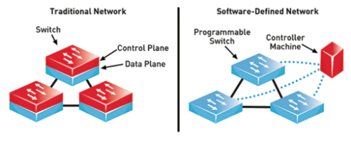
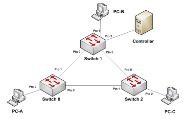
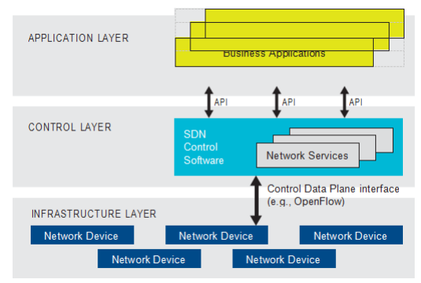

# Proyecto-Final-Abdala Candelo Cifuentes

## **Parte 1: Redes Definidas por Software (SDN)**

Las redes tradicionales se ven altamente caracterizadas por la presencia de dispositivos como lo son routers y switches principalmente, que cuentan con un plano de datos, encargado del reenvío de información, y un plano de control que es donde se implementa el software encargado de el correcto funcionamiento de cada dispositivo. Los avances en comunicaciones que se están presentando están comenzando a desvelar dificultades en las redes tradicionales entre las que destacan la gran inversión de tiempo que se requiere para añadir nuevos dispositivos a una red debido a la complejidad que se requiere para administrarlas, y la poca escalabilidad que se da con las redes tradicionales debido a los avances casi inexistentes que se han dado en el campo en los últimos años [1]. Por ello se proponen las SDN (Redes Definidas por Software).
Las SDN surgen como un paradigma de red relativamente nuevo [1]. El principal cambio con las redes tradicionales es el desacople que se hace entre el plano de reenvío de datos y el plano de control. En otras palabras, el principal objetivo de esta solución es que se sigan manteniendo los dispositivos de red tradicionales, pero que el software necesario para su funcionamiento sea configurado por medio de un controlador central que usa un protocolo para comunicarse con los controladores de red, este protocolo se llama OpenFlow y permite programar de manera más sencilla y eficiente el funcionamiento de cada uno de los dispositivos pertenecientes a la red, brindando facilidad a la hora de gestionar la misma [2].

OpenFlow recopila por medio de mensajes estandarizados datos relacionados con el flujo, esto con el propósito de crear tablas que determinen cuál es la mejor manera de reenviar paquetes y de esta manera brindar la información y cambios necesarios a los dispositivos de red para mejorar la eficiencia de la red de una manera dinámica y automatizada, reduciendo notablemente el tiempo de configuración y los costos operacionales en las empresas de telecomunicaciones [2].

## Tipos de SDN

Las SDN pueden verse divididas en principalmente cuatro tipos [3] cuales son:

·        SDN Overlay Model: Los dispositivos son programables por aplicaciones como lo puede ser OnePK, estas aplicaciones se ejecutan en el mismo dispositivo o en un servidor en la red.

·        Open SDN: Utiliza un controlador centralizado el cual tiene conocimiento sobre todos los dispositivos de la red, lo que da una facilidad mayor a la hora de gestionar la red desde el controlador.

·        SDN by APIs: Las políticas están establecidas principalmente para recopilarlos y así determinar el comportamiento de la red. Se deben priorizar ciertos casos para así anticipar algunas situaciones que podrían afectar el desarrollo de la red.

·        Hybrid SDN: Este tipo de SDN es la combinación de una SDN perteneciente a cualquiera de las anteriores tres con una de red tradicional para poder ejecutar diferentes funciones verificando que no se generen dificultades por el cambio de estructura o de configuración de las redes.

## Funcionamiento del paradigma SDN 

El SDN presenta diferencias frente al tradicional, la más importantes son los llamados controllers, pueden ser representados como servidores con la capacidad de ejecutar el software controlador.[4] La figura muestra la topología de una red implementada a través de SDN

Para establecer comunicación entre el PC-A y el PC-B, envía una trama a través de la interfaz conectada al switch como en el paradigma tradicional, cuando la trama está dentro de switch el paradigma entra en uso, esté observa y analizar los encabezados recibidos, puede analizar headers de capa 2, 3 y 4, mientras que el paradigma tradicional solo revisar los de capa 2. Si el switch no tiene información en sus tablas de flujo este paquete será enviado al controlador para obtener información necesaria sobre qué hacer con dicho paquete, el controlador indica al switch que el paquete se debe enviar por el puerto 1 dándole nueva información a su tabla de flujo, este proceso se repetirá cada vez que el paquete pase de un dispositivo a otro. Cuando llega a su destino, si se genera una respuesta el paquete hace este mismo procedimiento para determinar la ruta, cuando genera comunicación bidireccional los paquetes enviados entre estos dos hosts no se envían al controlador[4].

Las políticas de enrutamiento para definir el comportamiento de la red son definidas por el administrador o programador de la red en el controlador, permite programar el comportamiento de la red a voluntad del administrador haciendo que el paquete se enruta hacia determinado puerto de muchas maneras, algunas son la dirección MAC, IPv4 o IPv6 de origen o destino, entre otras. Cada dispositivo tiene una tabla de enrutamiento, pero el controlador tiene el mapa controlador que llena la tabla de cada switch en base a su necesidad [4].

Adicionalmente con la arquitectura del SDN se obtiene una gestión independiente del proveedor en toda la red desde un aspecto lógico, simplificando el diseño de red en operadores basados en software los cuales componen la capa de control que es intermediaria para las capas de infraestructura y la capa de aplicación[5].

## Ventajas del paradigma SDN frente al modelo tradicional

Un estudio [6] busco analizar los resultados entre una topología tradicional y una con SDN, realizando consultas a través del ICMP la obtención de datos se realizó observando los parámetros del sistema durante la simulación, los resultados determinaron dos ventajas del SDN: Su rendimiento es mejor y su base en protocolos y estándares abiertos, este último tiene algunos inconvenientes: incompatibilidad entre protocolos SDN, características de funcionalidad exclusivas definidas por  proveedores, limitando a marcas específicas al considerar la escalabilidad para tener una mayor productividad en la infraestructura de red[6].

Otra ventaja es la adaptabilidad a la naturaleza cambiante de las funciones y aplicaciones inteligentes, esta capacidad reduce costes de infraestructura y administración simplificada. Las implementaciones de modelos basados en SDN permiten la facilidad de estas aplicaciones en redes amplias, aunque el alcance a redes LAN está condicionado a su funcionamiento[6].

Algunos beneficios adicionales propuestos por Vadluri [5], son la eficiencia en la gestión, esta permite manipular las cualidades de la red desde otra ubicación, la programabilidad de la red se maneja de forma más eficiente y centralizada mejorando la funcionalidad del diseño del tráfico y disminuir el bloqueo y ofrece vigilancia delicada en los dispositivos mejorando la protección de un entorno virtualizado[5].

## **Parte 2 Red Empresarial Mininet**

## Instalación
## Oracle VM Virtual Box
Debido a los requerimientos para el uso de Mininet, software que solo puede ser ejecutado en el sistema operativo Linux, fue necesario hacer uso del servicio Oracle VM Virtual Box ofrecido por la empresa Oracle con el propósito de crear un entorno virtualizado que trabaje bajo el sistema operativo anteriormente mencionado. Para ello es necesario descargar la aplicación desde el sitio oficial de la empresa e instalarla. Si bien es posible crear directamente un entorno de Linux haciendo uso del servicio, se prefirió por facilidades del desarrollo del proyecto crear la máquina virtual por medio de el Software Vagrand que nos brinda directamente las herramientas necesarias para el desarrollo del proyecto sin necesidad de requerir una gran cantidad de instalaciones adicionales ya dentro de la máquina virtual. Si bien más adelante se hablará de la instalación de Vagrand, por el momento es importante tener en cuenta que, si bien la máquina virtual es creada con este software, esta puede ser inicializada desde Oracle VM Virtual Box como si se hubiera creado en la aplicación, facilitando el acceso al entrono virtualizado que se usará para el desarrollo del proyecto.

## puTTY
## Planteamiento

## **Bibliografia**

[1]      	J. Silva, «Tecnología de red definida por software para el aprendizaje en grupos de investigación y educación», Revista Innova Educación, vol. 3, n.o 3, pp. 85-96, jul. 2021, doi: 10.35622/j.rie.2021.03.005.

[2]      	D. Iglesias De La Torre, F. Álvarez Paliza y A. Ramos Fleites, «Combinación de los Mecanismos MPLS en una Arquitectura SDN,» Revista Telemática, vol. 18, n.° 1, pp. 1-10 ene. 2019.

[3]      	VM Ware, «VM Ware - Software Defined Networking,» VM Ware, 2023. [En línea]. Available: https://www.vmware.com/topics/glossary/content/software-defined-networking.html. [Último acceso: 09 05 2023].

[4]    	M. Ramírez and A. López, “Redes de datos definidas por software - SDN, arquitectura, componentes y funcionamiento Software,” Journal de ciencia e ingeniría, vol. vol.10, no, no. Redes de datos definidas por software, p. 7, 2018.

[5]    	M. Benifits and O. F. Sdn, “A COMPREHENSIVE REVIEW ON SDN ARCHITECTURE , APPLICATIONS AND A COMPREHENSIVE REVIEW ON SDN ARCHITECTURE , APPLICATIONS AND MAJOR BENIFITS OF SDN,” no. January, 2019.

[6]    	P. Alcívar and M. Navia, “Comparison between traditional network and software defined network: Case of study ESPAM MFL | Comparativa entre red tradicional y red definida por software: Caso de estudio ESPAM MFL,” RISTI - Revista Iberica de Sistemas e Tecnologias de Informacao, vol. 2020, no. E29, pp. 79–90, 2020.
