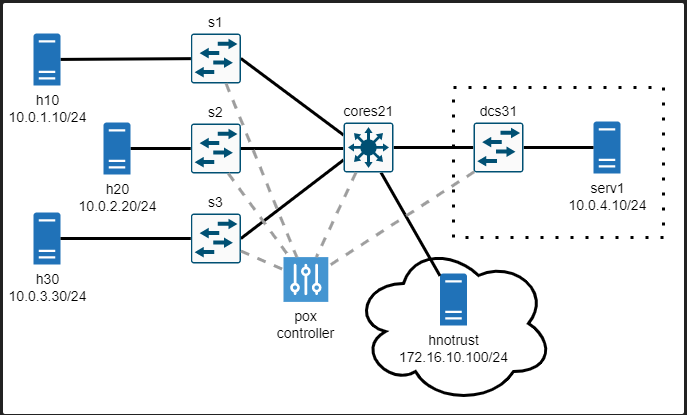

# Proyecto-Final-Abdala Candelo Cifuentes

## **Parte 1 - Redes Definidas por Software (SDN)**

Las redes tradicionales se ven altamente caracterizadas por la presencia de dispositivos como lo son routers y switches principalmente, que cuentan con un plano de datos, encargado del reenvío de información, y un plano de control que es donde se implementa el software encargado de el correcto funcionamiento de cada dispositivo. Los avances en comunicaciones que se están presentando están comenzando a desvelar dificultades en las redes tradicionales entre las que destacan la gran inversión de tiempo que se requiere para añadir nuevos dispositivos a una red debido a la complejidad que se requiere para administrarlas, y la poca escalabilidad que se da con las redes tradicionales debido a los avances casi inexistentes que se han dado en el campo en los últimos años [1]. Por ello se proponen las SDN (Redes Definidas por Software).
Las SDN surgen como un paradigma de red relativamente nuevo [1]. El principal cambio con las redes tradicionales es el desacople que se hace entre el plano de reenvío de datos y el plano de control. En otras palabras, el principal objetivo de esta solución es que se sigan manteniendo los dispositivos de red tradicionales, pero que el software necesario para su funcionamiento sea configurado por medio de un controlador central que usa un protocolo para comunicarse con los controladores de red, este protocolo se llama OpenFlow y permite programar de manera más sencilla y eficiente el funcionamiento de cada uno de los dispositivos pertenecientes a la red, brindando facilidad a la hora de gestionar la misma [2].


OpenFlow recopila por medio de mensajes estandarizados datos relacionados con el flujo, esto con el propósito de crear tablas que determinen cuál es la mejor manera de reenviar paquetes y de esta manera brindar la información y cambios necesarios a los dispositivos de red para mejorar la eficiencia de la red de una manera dinámica y automatizada, reduciendo notablemente el tiempo de configuración y los costos operacionales en las empresas de telecomunicaciones [2].

## Tipos de SDN

Las SDN pueden verse divididas en principalmente cuatro tipos [3] cuales son:

·        SDN Overlay Model: Los dispositivos son programables por aplicaciones como lo puede ser OnePK, estas aplicaciones se ejecutan en el mismo dispositivo o en un servidor en la red.

·        Open SDN: Utiliza un controlador centralizado el cual tiene conocimiento sobre todos los dispositivos de la red, lo que da una facilidad mayor a la hora de gestionar la red desde el controlador.

·        SDN by APIs: Las políticas están establecidas principalmente para recopilarlos y así determinar el comportamiento de la red. Se deben priorizar ciertos casos para así anticipar algunas situaciones que podrían afectar el desarrollo de la red.

·        Hybrid SDN: Este tipo de SDN es la combinación de una SDN perteneciente a cualquiera de las anteriores tres con una de red tradicional para poder ejecutar diferentes funciones verificando que no se generen dificultades por el cambio de estructura o de configuración de las redes.

## Funcionamiento del paradigma SDN 

El SDN presenta diferencias frente al tradicional, la más importantes son los llamados controllers, pueden ser representados como servidores con la capacidad de ejecutar el software controlador.[4] La figura muestra la topología de una red implementada a través de SDN


Para establecer comunicación entre el PC-A y el PC-B, envía una trama a través de la interfaz conectada al switch como en el paradigma tradicional, cuando la trama está dentro de switch el paradigma entra en uso, esté observa y analizar los encabezados recibidos, puede analizar headers de capa 2, 3 y 4, mientras que el paradigma tradicional solo revisar los de capa 2. Si el switch no tiene información en sus tablas de flujo este paquete será enviado al controlador para obtener información necesaria sobre qué hacer con dicho paquete, el controlador indica al switch que el paquete se debe enviar por el puerto 1 dándole nueva información a su tabla de flujo, este proceso se repetirá cada vez que el paquete pase de un dispositivo a otro. Cuando llega a su destino, si se genera una respuesta el paquete hace este mismo procedimiento para determinar la ruta, cuando genera comunicación bidireccional los paquetes enviados entre estos dos hosts no se envían al controlador[4].

Las políticas de enrutamiento para definir el comportamiento de la red son definidas por el administrador o programador de la red en el controlador, permite programar el comportamiento de la red a voluntad del administrador haciendo que el paquete se enruta hacia determinado puerto de muchas maneras, algunas son la dirección MAC, IPv4 o IPv6 de origen o destino, entre otras. Cada dispositivo tiene una tabla de enrutamiento, pero el controlador tiene el mapa controlador que llena la tabla de cada switch en base a su necesidad [4].

Adicionalmente con la arquitectura del SDN se obtiene una gestión independiente del proveedor en toda la red desde un aspecto lógico, simplificando el diseño de red en operadores basados en software los cuales componen la capa de control que es intermediaria para las capas de infraestructura y la capa de aplicación[5].


## Ventajas del paradigma SDN frente al modelo tradicional

Un estudio [6] busco analizar los resultados entre una topología tradicional y una con SDN, realizando consultas a través del ICMP la obtención de datos se realizó observando los parámetros del sistema durante la simulación, los resultados determinaron dos ventajas del SDN: Su rendimiento es mejor y su base en protocolos y estándares abiertos, este último tiene algunos inconvenientes: incompatibilidad entre protocolos SDN, características de funcionalidad exclusivas definidas por  proveedores, limitando a marcas específicas al considerar la escalabilidad para tener una mayor productividad en la infraestructura de red[6].

Otra ventaja es la adaptabilidad a la naturaleza cambiante de las funciones y aplicaciones inteligentes, esta capacidad reduce costes de infraestructura y administración simplificada. Las implementaciones de modelos basados en SDN permiten la facilidad de estas aplicaciones en redes amplias, aunque el alcance a redes LAN está condicionado a su funcionamiento[6].

Algunos beneficios adicionales propuestos por Vadluri [5], son la eficiencia en la gestión, esta permite manipular las cualidades de la red desde otra ubicación, la programabilidad de la red se maneja de forma más eficiente y centralizada mejorando la funcionalidad del diseño del tráfico y disminuir el bloqueo y ofrece vigilancia delicada en los dispositivos mejorando la protección de un entorno virtualizado[5].

## **Parte 2 - Planteamiento de la Red Empresarial Mininet**

## Instalación
## Oracle VM Virtual Box
Debido a los requerimientos para el uso de Mininet, software que solo puede ser ejecutado en el sistema operativo Linux, fue necesario hacer uso del servicio Oracle VM Virtual Box ofrecido por la empresa Oracle con el propósito de crear un entorno virtualizado que trabaje bajo el sistema operativo anteriormente mencionado. Para ello es necesario descargar la aplicación desde el sitio oficial de la empresa e instalarla. Si bien es posible crear directamente un entorno de Linux haciendo uso del servicio, se prefirió por facilidades del desarrollo del proyecto crear la máquina virtual por medio de el Software Vagrand que nos brinda directamente las herramientas necesarias para el desarrollo del proyecto sin necesidad de requerir una gran cantidad de instalaciones adicionales ya dentro de la máquina virtual. Si bien más adelante se hablará de la instalación de Vagrant, por el momento es importante tener en cuenta que, si bien la máquina virtual es creada con este software, esta puede ser inicializada desde Oracle VM Virtual Box como si se hubiera creado en la aplicación, facilitando el acceso al entrono virtualizado que se usará para el desarrollo del proyecto.


## Vagrant

Como ya fue mencionado vagrant sera el sistema que nos permitira tener las herramientas de mininet a la mano para poder realizar los requerimientos del proyecto, para la instalación descargamos el programa en la pagina de vagrant y lo instalamos. 

Posteriormente necesitamos clonar un repositorio de git que utilizamos para instalar mininet, para este proyecto utilizamos el siguiente git: https://gitlab.cs.washington.edu/561p-course-staff/mininet-environment. Est git especificamente tiene caracteristicas necesarias para el uso de mininet que otros metodos de instalación no tenian como lo son caracteristicas adicionales en el vagrant file. 

Una vez ya tenemos clonado el repositorio de git, creamos una carpeta donde esta clonado el git, en el cmd accedemos a esta carpeta y utilizamos el comando **vagrant up**, con este comando iniciaremos vagrant, el cual implementara todas las funciones de mininet, cuando este termina podremos ver en nuestra maquina virtual, que la instancia de mininet ha sido creada y esta corriendo en segundo plano


## puTTY

Para el desarrollo del laboratorio fue necesario hacer uso de la herramienta puTTY, esto con el propósito de crear una conexión SSH con cada nodo de la topología establecida. Esto funciona para poder acceder a la línea a de comando de cada nodo de manera más fácil y administrarlos como si se estuviera trabajando directamente en cada uno. Con esto se puede monitorizar y hacer pruebas de funcionamiento para el desarrollo del proyecto. 
La instalación de puTTY es bastante simple. Lo primero será descargarlo desde su sitio web e instalarlo en el dispositivo. Después de haber iniciado sesión como usuario Vagrant, será necesario hacer uso del servicio puTTY Key Generator, esta herramienta será usada para lograr hacer que la private key que nos brinda Vagrant pueda ser leída y entendida por puTTY.


Se guardará el archivo de la nueva private key que después tendrá que ser configurada en puTTY. Seguido a esto, ya podremos comenzar a configurar desde puTTY. Ya dentro de la aplicación , Vagrant nos dará unas especificaciones como por ejemplo el puerto, lo que será necesario al momento de configurarlo.


Después de esto, será necesario activar el servicio Xming, este no abrirá ninguna ventana, sin embargo, comenzará a correr en segundo plano. En la barra de tareas, este servicio nos brindara un dato que también es necesario para configurar en puTTY.


Seguido a esto, será necesario brindarle las credenciales de acceso del usuario de Vagrand a puTTY para que este pueda acceder de manera automática cuando sea necesario.


Finalmente, se guardarán todas las configuraciones asignadas en un usuario llamado Vagrant (Fue el elegido, no necesariamente tiene que ser esta) que será el que nos brinde la posibilidad de usar todas las opciones de puTTY en la máquina virtual creada por Vagrant.

## SSH en visual studio
Una vez tenemos los componentes presentados anteriormente, para el caso de este grupo decidimos manipular la caracteristicas de mininet a travèz de visual studio ya que es mucho más sencillo de realizar los requerimientos que en la propia consola de la maquina virtual.

Para establecer conexion entre nuestra maquina virtual y el entorno de visual studio por medio de ssh y configurar las propiedades de los archivos, en el powershell de microsoft usamos el comando **vagrant ssh-config**. Este comando nos proporcionara diferente información. 

Desde visual studio sera necesario instalar la extención de remote developer, esta de igual manera instalara automaticamente algunas extenciones adicionales **(ssh, ssh editing)** cuando esta instalado, en la esquina inferior izquierda del visual studio aparecera un boton con simbologia similar a ><, precionamos el boton y nos saldran diferente opciones de conexión. 


En este caso nos queremos conectar a un host, le damos a **configure SSH host** apareceran dos archivos que tienen guardada nuestra configuración SSH,  escogemos la primer opción, en el archivo que nos muestre copiamos la información que obtubimos gracias al comando vagrant ssh-config, toda esta información sera la necesaria para la conexión ssh. Guardamos estos cambios y regresamos a la opción de connect to host y usamos la instancia previamente creada, esto abrira una pestaña la cual nos preguntara que tipo de sistema estamos conectando, para este caso elegimos la opción **Linux** y en la parte inferior podemos observar que ya tenemos la conexión al hosto por medio de ssh.


Finalmente abrimos la carpeta desde la altura más alta para las carpetas de mininet donde esta el acceso a los dos proyectos, como pueba podemos usar el comando ls para ver las diferente carpetas desde la maquina virtual y podemos ver que dichas carpetas tambien son visibles y manipulables en visual. 


## Xming

Para poder visualizar nuestra topologia y tener una acceso a miniedit, que es la interfaz grafica para visualizar todos los procesos realizados en mininiet, utilizamos Xming el cual es una implementación protatil que ofrece un sistema de ventanas para microsoft, para el caso de este proyecto utilizamos PuTTY para realizar una implemantación SSH con la que, al conectar con nuestro PuTTY, podremos tener una vista grafica.

Para utilizar Xming abrimos nuestro installer de PuTTY y entramos a miniedit, posterioremente necesitamos configurar PuTTY para indicarle en ssh que pueda realizar forwardin en X11 para mandar GUI a otro lado, Xming corre por defecto en el :0.0 por lo que tnemos que especificar este en el x11, cuando lo guardamos ya sabe a donde mandar la parte virtual. 

Ya con la interfaz abierta podemos abrir y movernos por las diferentes carpetas con las que viene la insatalación 


## **Planteamiento**

## Requerimientos Solicitados

## Proyecto 2 – Parte 1

Después de explicada la topología, en esta sección explicaremos cuales son los requerimientos solicitados para ejecutar en la topología para de esta manera demostrar y comprender el funcionamiento de las herramientas implementadas para el desarrollo del proyecto.

Para esta primera parte se nos solicito hacer uso de la herramienta Pox para configurar los diferentes switches mostrados en la topología. El controlador debe de cumplir con las siguientes especificaciones:

- El hnotrust ubicado en la parte inferior de la imagen de la topología no debe poder hacer uso de tráfico ICMP cuando se quiera comunicar con h10, h20, h30 o serv1
-	El hnotrust ya antes mencionado no debe poder hacer uso de tráfico IP cuando se quiera comunicar con serv1

Quitando las dos condiciones anteriores, todo el tráfico debe estar permitido.

##  Proyecto 2 – Parte 2

Si bien para esta parte, la topología sigue siendo la misma, en este caso se nos solicita cambiar ciertos dispositivos con el propósito de implementar nuevas configuraciones que faciliten nuevas acciones en la topología.
El router cores21 debe cumplir funciones similares a las de un router, por lo que es necesario que el Pox tenga varias configuraciones según lo establecido que es lo siguiente:

 - Manejar el tráfico ARP en múltiples subredes como se muestra en la topología sin Forwarding.
 - Generar respuestas ARP cuando sean requeridas.
 - Reenviar tráfico IP a través de redes de Capa 2 así como en el interior de ellas.
 - Aprendizaje dinámico de la topología de Capa 3 de la red mostrada (Que subredes son accesibles en que puertos) haciendo uso del tráfico de snooping ARP.
 - Permitir que los Host’s se comuniquen bidireccionalmente con el servidor y con los otros Host’s cuando hayan aprendido las direcciones de destino.
 - Prevenir que hnotrust1 mande tráfico IP a serv1
 - Prevenir que hnotrust1 mande tráfico ICMP a Host’s regulares o al serv1
 - Permitir el tráfico bidireccional entre Host’s regulares y hnotrust1
 
Al igual que en la parte anterior, todo lo que no aplique entre las normas mencionadas, se debe permitir.

## Topologia

Para ambos aprendizajes de este proyecto (necesario y experto) utilizamos la misma topologia de red empresaria expuesta a continuación, ya que para el proyecto se nos pidio plantear este tipo de redes en el paradigma SDN con las diferentes caracteristica que expondremos más adelante.



¿Comó sabemos que esta topologia pertenece a una red empresarial? Pues como podemos observar en las dirección IP que hacen parte de los host podemos darnoas cuenta que hacen parte de subredes diferentes ya que su tercer octeto incrementa con cada host con los que cuenta la topologia, ademas el servidor 1 y el switch dcs31 estan agrupado por aparte, estos dos dispositivos forman lo que es un datacenter dentro las red privada a la cual los demas hos pueden acceder por medio del cores21 y Finalmente el servidor hnottrust hace parte de una red publica, por eso lleva dicho nombre. 

Con estas caracteristicas principales podemos determinar que la topologia efectivamente es de una red empresarial.

## **Parte 3 - Montaje y verificación de la red**

## **Montaje de la topología mediante mininet**

Para empezar con el montaje, partiremos de las topologías presentadas por la universidad de Washington. Rápidamente echaremos un vistazo a estas y explicaremos el montaje que reciben desde python estas redes.

**Red Parte 1**

En cuanto a la primera de las redes, como bien se explicó anteriormente la topología es relativamente simple a excepción de unos detalles. Como se puede ver en la imagen a continuación, cada uno de los hosts que se define tiene una ruta predeterminada correspondiente a un link, evidente en el uso del sufijo _eth0_. Haciendo esto, esta primera red se asegura de que la comunicación desde cualquier parte de la red puede salir de su prefijo de red sin necesidad de pasar por un router.


Nótese como el switch Cores21 se añade como un simple switch más a pesar de que la topología sugeriría que debería ser un router.

Además de esto, esta primera topología tiene un pequeño script que se ejecuta al crearse la clase topología el cual se encarga de llenar las tablas de enrutamiento de todo host en la red por medio de una serie de ciclos. Esto se puede ver a continuación.


En cuanto al direccionamiento, podemos ver que los hosts siguen un simple patrón debido al cual pertenecen a diferentes subredes como se postuló anteriormente, sin contar a _hnotrust_, quien tiene un IP propia de una red pública. Las redes MAC también se simplifican, al reducirse a una simple cadena de ceros culminada por un digito.

Por último, se añaden los links necesarios entre los diferentes hosts y switches, y con esto la topología está completamente terminada.

**Red Parte 2**

Esta segunda red cuenta con tan solo unos pocos cambios menores respecto a la topología previamente explicada. En concreto, ya no consta con un script que se encargue de llenar las tablas de direccionamiento ARP, y las direcciones predeterminadas se convierten en IPs en vez de puertos. La construcción de la topología en concreto se puede ver a continuación:


Así, cada host intentará comunicarse primero con su default gateway antes de poder proseguir con sus paquetes.

## **Montaje de los controladores en POX**

El siguiente paso para cumplir el proyecto postulado por la universidad de Washington es el de la configuración de los diferentes controladores POX para cumplir los requisitos explicados previamente.

**Red Parte 1**

Para empezar, nos encargamos de aplicar a los switches sin ningún requerimiento especial (s1, s2, s3 y dcs31) los Flow_Mods adecuados como para que todo tráfico pueda pasar a través de ellos. En este caso, hay que configurar en los setups de cada uno de estos switches el siguiente comando:

```
self.connection.send(of.ofp_flow_mod(action=of.ofp_action_output(port = of.OFPP_FLOOD), 
                                    priority=1))
```

Todo el resto de configuraciones necesarias ocurren desde el set-up del switch cores21. Los comandos aplicados para cumplir con los requerimientos fueron los siguientes:

```
self.connection.send(of.ofp_flow_mod(priority=50, match = of.ofp_match(dl_type=0x0800,
                                                          nw_src=IPS['hnotrust'],
                                                          nw_dst=IPS['serv1'])))

self.connection.send(of.ofp_flow_mod(priority=40, match = of.ofp_match(dl_type=0x0800,
                                                          nw_src=IPS['hnotrust'],
                                                          nw_proto=pkt.ipv4.ICMP_PROTOCOL)))

self.connection.send(of.ofp_flow_mod(action=of.ofp_action_output(port = of.OFPP_FLOOD), 
                                            priority=1))
```

A grandes rasgos, el primer comando se encarga de droppear todos los mensajes IPv4 que surjan desde el host _hnotrust_ y se dirijan a _serv1_, cumpliendo el primero de los requisitios, y el segundo de droppear todos los paquetes IPv4 que surjan del _hnotrust_ y sean de tipo ICMP.

Para finalizar, se permite todo el resto de tráfico para que la información pueda viajar libremente de punta a punta de la red.

**Red Parte 2**

El controlador POX de la segunda parte crece bastante en cuanto a complejidad se refiere. Para no sobresaturar la presente documentación, nos limitaremos a mencionar el funcionamiento general y flujo de la información, sin incluír el código como tal del script. Sin embargo, si el lector así lo desea, este archivo se encuentra adjunto en este mismo repositorio, si quiere ver más detenidamente el funcionamiento del controlador.

Para empezar, en cuanto a la restricción de ICMP y tráfico del host _hnotrust_, nos limitamos a copiar y pegar las soluciones que habíamos presentado para la anterior parte.

Una vez hecho esto, definimos un diccionario de Python en el switch _cores21_ desde el cual guardaríamos la dirección MAC y puerto asociado a las diferentes IPs que el switch fuera descubriendo.

Sin permitir ahora todo el tráfico que pase por _cores21_, hacemos uso del método predeterminado al que los eventos entran si no son atendidos por el pox controller para poder diferenciar entre los mensajes ARP y de tráfico IPv4. Esto, por supuesto, debido a los requerimientos presentados en esta parte.

Para empezar, si el mensaje es un mensaje de tipo **ARP**, dirigimos el flujo de la información hacia el método _handle_ARP. Este método se asegura de estar tratando solo con peticiones, y a su vez se encarga de llamar más métodos relacionados, en concreto _update y _reply_arp.

El método de _update es el método encargado de actualizar la tabla con la información de red actualizada a medida que diferentes hosts se comunican con el switch central. Dentro de este método verifica también el tipo de tráfico para asegurar que no haya ningún fallo con el manejo del flujo y las direcciones en OpenFlow.

El método de _reply_arp, por su parte, se encarga de responder las requests de ARP que pasan por el switch _cores21_. Sirviendonos del hecho de que todas las peticiones de ARP se hacen hacia la default gateway, debido a que los hosts se quieren comunicar con otros en diferentes redes y, por tanto, deben preocuparse solo del direccionamiento de capa 3 con respecto a ellos, el método está programado para responder siempre con una dirección MAC fuente creada en base al identificador único creado por OpenFlow para los diferentes switches. Así, todos los computadores pueden llenar sus tablas ARP para sus default gateways que, en realidad, no existen.

El segundo tipo de mensaje que nuestro método predeterminado maneja, son los mensajes de tipo **IPv4**. Al redirigir este tráfico al método _handle_traffic, el procesador verifica si la dirección de destino está ya registrada en la tabla mencionada anteriormente, a la vez con la actualiza con la información de fuente del mensaje. Si el switch conocela dirección de destino, entonces puede encargarse de construir una nueva trama con la dirección MAC apropiada, y reenviarla por el puerto asociado.

Con esto, el controlador está completo y debería ser capaz de manejar todo el tráfico relacionado con los requerimientos de la parte, si bien, como veremos más adelante, el proceso falla en algún punto debido a un error desconocido.

Cabe la pena mencionar que todo este código contiene múltiples comentarios de explicación para hacer el flujo de información mucho más digerible, y a su vez está lleno de statements de print para poder seguirle la pista a los diferentes mensajes que entran y salen, de igual forma que a los procesos realizados por los diferentes métodos.

## Ejecución de la red

Primero se ejecuta una sesión de PuTTY para la ejecución del pox controller por medio del comando 

```
sudo ~/pox/pox.py misc.a2part1controller
```

Una vez nuestro pox controller esta en ejecución necesitamos otra intancia de PuTTY para la ejecución de la topologia.

Para poder ejecutar la red y realizar las verificaciones necesarias para el funcionamiento de esta necesitamos ejecutar el proyecto en cuestion, para esto en nuestra maquina virtual debemos indicar el siguiente comando en cmd de linux

```
sudo python3 project-2/topos/part1.py
```

Una vez ejecutamos este comando nuestra maquina virtual pasara del CMD de linux al CLI de mininet por lo que se hace un cambio de nivel y los comando de verificación se realizán desde la vista de mininet.

## **Verificación de funcionamiento**
 
## **Parte 4 - Recomendaciones y Conclusiones**

## Recomendaciones

- Al momento de realizar la instalación de mininet existen variedades de opciones para usar mininet en la virtual box, sin embargo se recomienda la instalación presentada en el documento con Washington ya que este permitira una manipulación y configuración más eficiente por medio de visual studio

- Se recomienda la implementación de ssh con visual studio ya que permite una mayor facilidad y libertad para la configuración e implementación de la red, en especial para el apartado del aprendizaje experto fue una herramienta de mucha ayuda que nos permitio realizar diferentes modificaciones para hacer troubleshooting en nuestro codigo y solucionar muchos problemas 

- El uso de PuTTY consideramos que es un valor agregado ya que permite librarse de varios contras con los que cuenta el cmd de virtual box, cuando esta configurado tiene un axceso directo a xming para poder ver miniedit y simultaneamente tenr el apartado del pox controller, es decir que podemos tener varios PuTTys corriendo al tiempo, ademas de que corre en tu propio host por lo que todas tus caracteristicas pueden seguir siendo usadas y su navegación es mucho más sencilla.

## Conclusiones

Con la realización de este proyecto tanto en el apartado investigativo como en el apartado practico tenemos las siguientes conclusiones:

- Las redes SDN son paradigmas de red que estan en crecimiento, los cuales son configuraciones que permiten un mayor control en el trafico de paquetes, este paradigma trae consigo muchas ventajas como lo puede ser su libertad de configuración y que si se llega a presentar un problema en la topologia podemos arreglar el problema mucho más rapido que con el paradigma norma, sin embargo de igual manera cuenta con algunas desventajas como lo puede ser sus limitaciones y dificultad en la realización de las configuraciones. En resumen, el SDN es un paradigma muy util pero de igual maner requiere un conocimiento significativo para sacar todo el provecho de este
- Si bien SDN es una buena alternativa para el desarrollo de futuras redes en cualquier ámbito, es importante que la transición se haga de manera moderada evitando que haya algun tipo de colapso que pueda repercutir de manera negativa en los sistemas de redes actuales. Además es importante comenzar a preparar las redes actuales para el cambio debido a la necesidad que se ve en comenzar a implementar alternativas como las que nos ofrece SDN.


## **Bibliografia**

## Documentación parte 1

[1]      	J. Silva, «Tecnología de red definida por software para el aprendizaje en grupos de investigación y educación», Revista Innova Educación, vol. 3, n.o 3, pp. 85-96, jul. 2021, doi: 10.35622/j.rie.2021.03.005.

[2]      	D. Iglesias De La Torre, F. Álvarez Paliza y A. Ramos Fleites, «Combinación de los Mecanismos MPLS en una Arquitectura SDN,» Revista Telemática, vol. 18, n.° 1, pp. 1-10 ene. 2019.

[3]      	VM Ware, «VM Ware - Software Defined Networking,» VM Ware, 2023. [En línea]. Available: https://www.vmware.com/topics/glossary/content/software-defined-networking.html. [Último acceso: 09 05 2023].

[4]    	M. Ramírez and A. López, “Redes de datos definidas por software - SDN, arquitectura, componentes y funcionamiento Software,” Journal de ciencia e ingeniría, vol. vol.10, no, no. Redes de datos definidas por software, p. 7, 2018.

[5]    	M. Benifits and O. F. Sdn, “A COMPREHENSIVE REVIEW ON SDN ARCHITECTURE , APPLICATIONS AND A COMPREHENSIVE REVIEW ON SDN ARCHITECTURE , APPLICATIONS AND MAJOR BENIFITS OF SDN,” no. January, 2019.

[6]    	P. Alcívar and M. Navia, “Comparison between traditional network and software defined network: Case of study ESPAM MFL | Comparativa entre red tradicional y red definida por software: Caso de estudio ESPAM MFL,” RISTI - Revista Iberica de Sistemas e Tecnologias de Informacao, vol. 2020, no. E29, pp. 79–90, 2020.

## Documentación parte 2

- https://courses.cs.washington.edu/courses/csep561/22sp/projects/project2/
- https://gist.github.com/leomindez/3e6d29d341a0fd666e6ae799bfa32ca1
- https://courses.cs.washington.edu/courses/csep561/22sp/projects/project2/
- https://courses.cs.washington.edu/courses/csep561/22sp/projects/project1/
- https://noxrepo.github.io/pox-doc/html/#forwarding-l3-learning
- https://gitlab.cs.washington.edu/561p-course-staff/mininet-environment
- https://www.youtube.com/watch?v=MlACzrm0SCw&t=8s